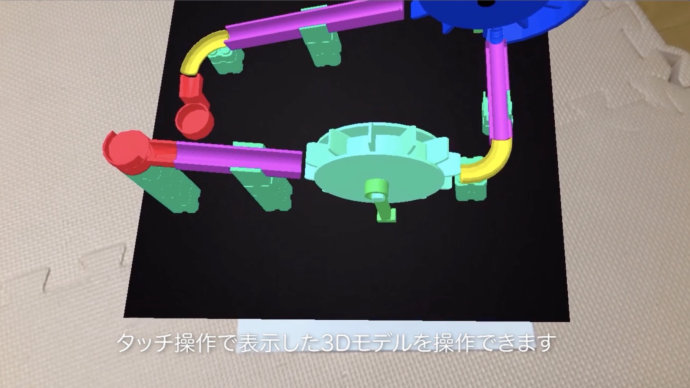
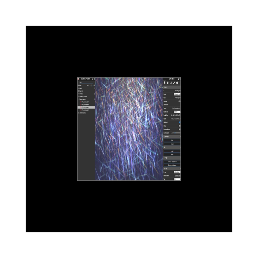

# bjs_effects

  

# Background

The repo is a base of project published from AR.js Studio.  

[AR.js Studio](https://ar-js-org.github.io/studio/) creates WebAR source code. 

# Usage

1. Put your "assets" folder and index.html on "public" folder"  

"assets" folder and index.html are generated from AR.js Studio.  

2. Put your certified key files on "certkeys" foleder.  

See the post to create certified key fiels (Japanese)  
https://www.crossroad-tech.com/entry/express-http-server  

3. npm install  

```bash
npm install
```

4. run express (https server)

```bash
$ node server.js
```

5. Print or display AR marker   

In this repository, use the marker.  

    


6. Access the URL

https://localhost:8080


You should grant motion sensor permission on your mobile.  

See also the movie (click and jump to You Tube)  


[](https://www.youtube.com/watch?v=WfwCRyDCXq8)